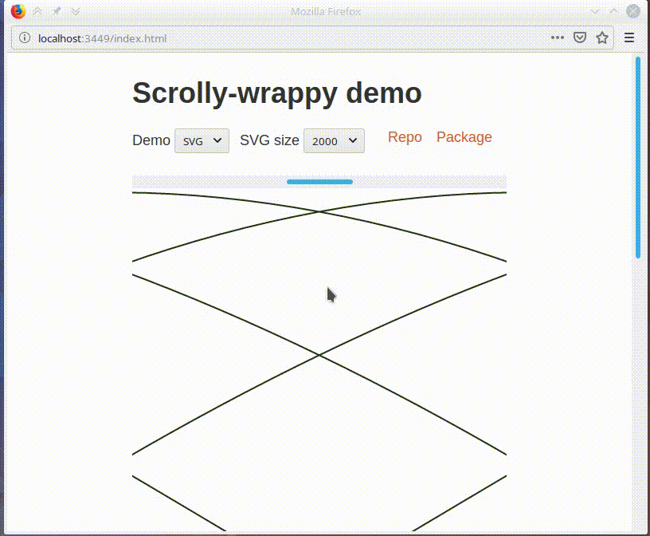

# scrolly-wrappy [](https://clojars.org/scrolly-wrappy)

Reagent component to provide a friendly 2-dimensional drag-to-scroll experience. [Browser demo](https://karolinepauls.gitlab.io/scrolly-wrappy/).

On mobile (tested on Firefox for Android and Chrome) the difference from the native experience
is in 2-dimensionality of scrolling (normally it is locked to whichever axis the browser detects as
dominating) and lack of momentum-based scrolling, which may be detrimental.



## Overview

The component wraps arbitrarily long and wide content, providing horizontal drag-to-scroll within
the boundaries of the wrapper and vertical drag-to-scroll synchronised with the entire page.

```clojure
(defn demo-view []
  [scrolly-wrappy
   [:svg {:width "2000px" :height "2000px"}
    [:path {:d "M 1 1999 L 999 1 L 1999 1999 L 1 1999" :fill "#aaa" :stroke "#333"}]]])
```

It is the caller's job to correctly centre the content in case happens to be smaller than the
wrapper.


### Options

```clojure
(def is-dragged? (r/atom false))  ; Use it do e.g. disable interactivity of dragged content.

(defn demo-view []
  [scrolly-wrappy {:initial-centre-fn (fn [width] (- width (/ width 4)))  ; Centre at 3/4.
                   :on-drag-start #(reset! is-dragged? true)
                   :on-drag-end #(reset! is-dragged? false)}
   [:svg {:width "2000px" :height "2000px"}
    [:path {:d "M 1 1999 L 999 1 L 1999 1999 L 1 1999" :fill "#aaa" :stroke "#333"}]]])
```

### Style

You may want to add the following CSS.

```css
div.scrolly-wrappy-wrapper:hover {
    cursor: pointer;
}
```

## Dev/demo Setup

To get an interactive development environment/demo run:

    lein figwheel

and open your browser at [localhost:3449](http://localhost:3449/).
This will auto compile and send all changes to the browser without the
need to reload. After the compilation process is complete, you will
get a Browser Connected REPL. An easy way to try it is:

    (js/alert "Am I connected?")

and you should see an alert in the browser window.

To clean all compiled files:

    lein clean

To build a figwheel-less demo, run:

    lein do clean, cljsbuild once static-demo

And open your browser in `resources/public/index.html`. You will not
get live reloading, nor a REPL. 

## Acknowledgements

The scrolly-wrappy component has been extracted from https://github.com/infectious/ephyra.

## License

See LICENCE.

Copyright © 2019 Karoline Pauls, Infectious Media
